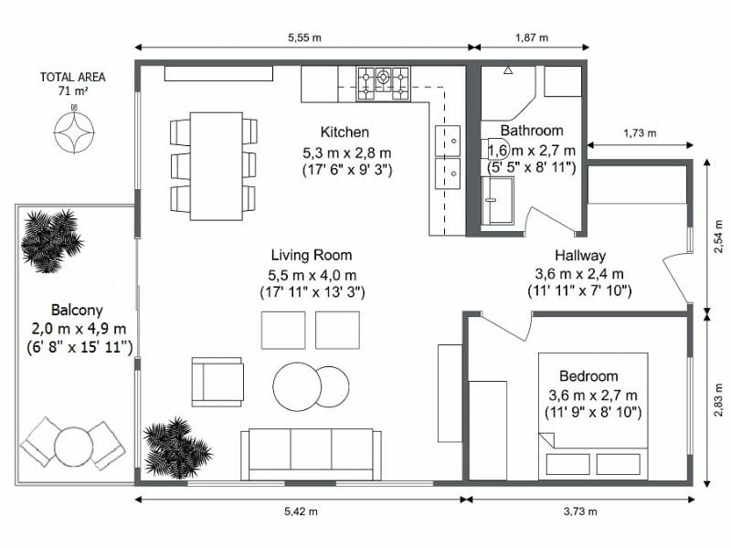
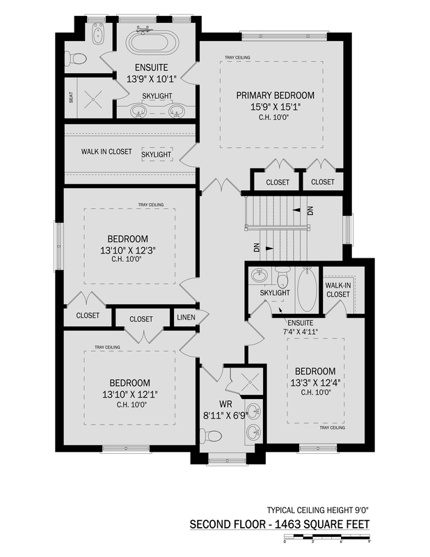

1. In order to run the pdf2image.sh in the terminal you first need to install imagemagick. If MAC user, you can do brew install imagemagick
    

2. Rules for removing text and unnecessary parts of image: (1) Remove All Text (even small ones) (2) Remove Dotted lines (3) Remove Shaded plots (striped lines)
    
   GOAL:  
   Just het the outline of the plot (all the boxes)
    
   Example1:  
   Input
   
   output
   .jpg>)
   Example2:  
   Input
   
   output
   .jpg>)

    

3. Rules for getting the basic outline (no internal plot/boxes): (1) run the sam_box.py on that image (video of how to use it will be found here: ). (2) If it doesn't give you the optimal output make sure to remove the internal boxes by yourself.
    
   Example1:
    
   Input:
   .jpg>)
   output:
   .jpg>)

   Example2:
   Input:
   .jpg>)
   Output:
   .jpg>)

    
   **IMPORTANT**
    
   IF NOT Familiar with sam_box.py after watching video and trying by yourself, feel free to remove the boxes and internal plots by hand.  
   A website that is helpful in editing photos is: www.photopea.com
